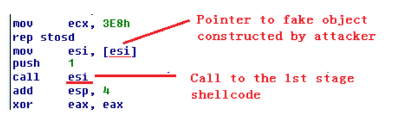
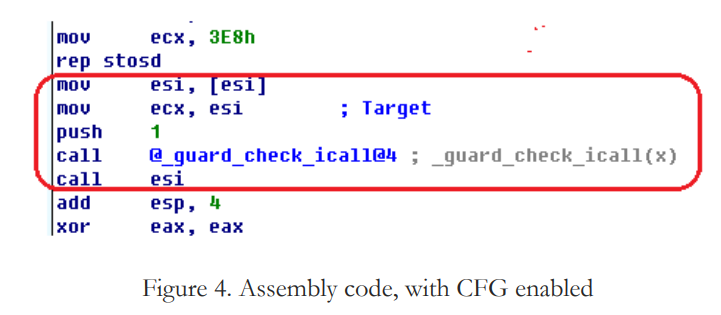
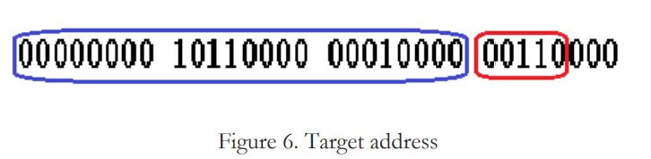
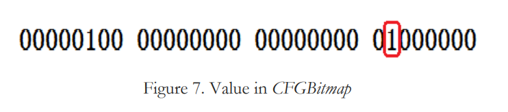

# Lets talk about Control Flow Guard now!

CFG is a mitigation technology to prevent control flow being redirected to unintended locations, 
by validating the target address of an indirect branch before it takes place

## Resources
1) https://paper.seebug.org/papers/Security%20Conf/Blackhat/2017_asia/asia-17-Sun-Never-Let-Your-Guard-Down-Finding-Unguarded-Gates-To-Bypass-Control-Flow-Guard-With-Big-Data.pdf
2) https://documents.trendmicro.com/assets/wp/exploring-control-flow-guard-in-windows10.pdf?_ga=2.153245688.153772636.1619702751-827707586.1619702751

## No CFG


## With CFG


If compiler-implemented, goes to a CF Function Table.

If OS implemented, goes to CFG Bitmap

Before the indirect call, the target address is passed to the _guard_check_icall function.
In Windows 10, it points to *ntdll!LdrpValidateUserCallTarget*.

This function takes a target address as argument and does the following:

1) Access a bitmap (*CFGBitmap*) which represents the **starting location** of all the functions in 
the process space. The status of every 8 bytes in the process space corresponds to a bit in *CFGBitmap*.
**What does this status means???**

2) Example address of 0x00b01030. The highest 3 bytes (0x00b010) is the offset for CFGBitmap while 
the last byte will give the value of X. 



Target address of 0x00b01030:
First 3 bytes gives the pointer to CFGBitMap (in blue)
Last byte gives X (in red)

```
Pointer to CFGBitMap = CFGBitmap + 0x00b010
```

3) Checks if target address is aligned with 0x10 (Target address & 0xF)

If its aligned, X is the bit offset value within the unit.

If not aligned, X | 0x1 is the bit offset value. ~~Isn't X | 0x1 always X?~~ (6 | 1 can be 7)

4) In this case, X = 6. Now using the pointer to CFGBitMap, we check the 6th bit.

Since the sixth bit, if it is 1, the indirect call target is a valid function address.
Else, invalid and trigger exception!!!

## New mitigations??? Return Flow Guard 
Protects overwriting return address on stack
 