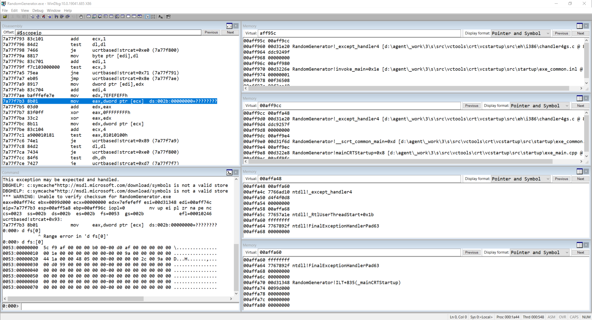
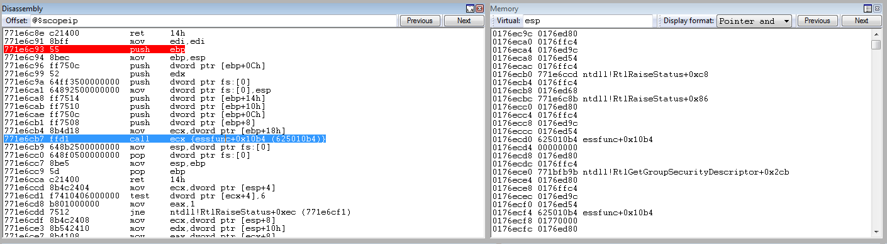

# Learning about SEH
https://www.corelan.be/index.php/2009/07/25/writing-buffer-overflow-exploits-a-quick-and-basic-tutorial-part-3-seh/

This readme is just a summary of corelan website above. And my OSED prep maybe, will update if this is useful once course starts.

## Stack view on SEH Chain Components


## Structure of SEH record 

Note that SEH record is 8 bytes and has 2 elements.
1. Pointer to next SEH record
2. Pointer to Exception Handler

At the most bottom is the default exception handler, the OS handler.

0xff ff ff ff indicates the end of the SEH chain

## Happenings when code faults
At position FS:[0x00] or the TIB, there is the head of the exception handler chain.
When an exception occurs, ntdll.dll kicks in and retrieves the head of the SEH chain, walks through the list and finds the suitable handler. If no handler is found, the default Win32 handler will be used (at the bottom of the stack)

at fs:[0] -> first 4 bytes is the head of the SEH chain
Going to the pointer, will have it pointing to the next frame.

## Entire SEH Chain


### My version


Windbg snapshot is when application crashes:
```
Running d fs:[0] shows TIB is at 0x00aff95c
```

Looking at the memory pane on the top left, we see a pointer to another exception record. A handler is also registered.
With debug symbols, it can be identified as _except_handler4 which is what written in the code.
The SEH Linked List can be further parsed to 0xffffffff which is the bottom of the SEH chain.

SEH exploit hardening
Since windows XP SP1, before exception handler is called, all registers are XORed/NULLed. Won't find a reference to payload in one of the registers.

## Exploitation Concept


Payload must do the following things

1) Cause an exception. Without an exception, the SEH handler (the one you have overwritten/control) won’t kick in
2) Overwrite the pointer to the next SEH record with some jumpcode (so it can jump to the shellcode)
3) Overwrite the SE handler with a pointer to an instruction that will bring you back to next SEH and execute the jumpcode.
4) The shellcode should be directly after the overwritten SE Handler. Some small jumpcode contained in the overwritten “pointer to next SEH record” will jump to it).


				
Why can't you just do a jump at the SE Handler to shellcode?
SEH Handler's pop pop ret must be a SafeSEH unprotected address 
Attempted to use a ROP gadget from kernel32.dll but fail. 
Probably if we have a jump instruction can work!


WinDBG Commands:
```
!anaylze -v // can also be used for userland exception
d fs:[0]	// view TIB
!exchain 	// output the frame (next SEH pointer | SE Handler)

Debugging SafeSEH
bp ntdll!RtlGetGroupSecurityDescriptor+0x299
bp ntdll!RtlRaiseStatus+0x8e
ebp-8 016ee000 
bp 625010b4 
```


## Analysing the call stack disassembly


```
//builds EXCEPTION_REGISTRATION structure on the stack
771e6c99 52              push    edx
771e6c9a 64ff3500000000  push    dword ptr fs:[0]

stack looks like this:
0186ecac 0186ffc4 
0186ecb0 771e6ccd ntdll!RtlRaiseStatus+0xc8

//Install new EXCEPTION_REGISTRATION
771e6ca1 64892500000000  mov     dword ptr fs:[0],esp

//Don't understand this instructions...
771e6ca8 ff7514          push    dword ptr [ebp+14h]
771e6cab ff7510          push    dword ptr [ebp+10h]
771e6cae ff750c          push    dword ptr [ebp+0Ch]
771e6cb1 ff7508          push    dword ptr [ebp+8]
771e6cb4 8b4d18          mov     ecx,dword ptr [ebp+18h]
771e6cb7 ffd1            call    ecx {essfunc+0x10b4 (625010b4)}

```

