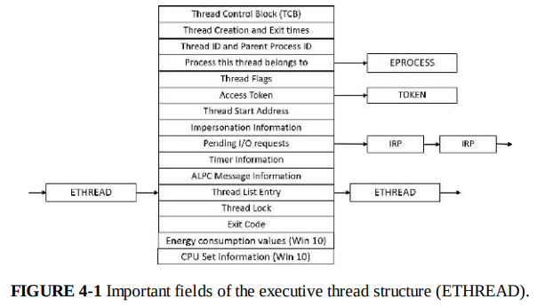
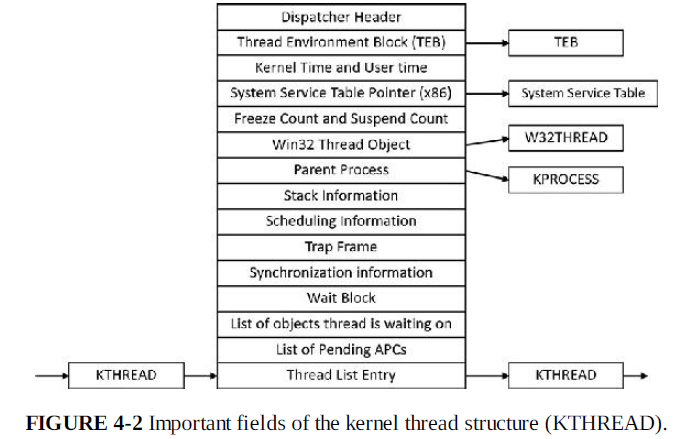

# Chapter 4 - Threads

## Things that I never knew

1) Optional stack size

2) CreateRemoteThread is a common technique for debugger to force a break in debugged process
	- Also use to obtain internal information about another process
	
3) CreateThread and CreateRemoteThread eventually calls CreateRemoteThreadEx and NtCreateThreadEx
	- NtCreateThreadEx will trainsit into kernel mode

4) Creating a thread in kernel mode is achieved with the PsCreateSystemThread (can create thread in ANY process)

5) Windows thread is represented by an executive thread object 
	- ETHREAD structure
	- KTHREAD structure
	
6) ETHREAD structure exists in system address space, while TEB exists in process address space

	- Interesting fields:
		1) Process this thread belongs to -> EPROCESS
		2) Access Token
		3) Pending I/O Requests points to IRP
		4) ETHREAD -> Thread List Entry -> ETHREAD
	
	- First member is called TCB (actually a structure of type KTHREAD)
	- ***Process Identification Information***
		- ***Stores a pointer to the owning process***

7) KTHREAD structure

	- Interesting fields:
		1) Dispatcher Header
		2) ***TEB (In Userland)***
		3) Wait Block
		4) List of pending APCs
		5) KTHREAD -> Thread List Entry -> KTHREAD
		
	- KTHREAD structure contains information that the windows kernel need to perform:
		1) Thread scheduling
		2) Synchronization
		3) Time-keeping
		
8) Thread Scheduling 
	- Ranges from 0 to 31 (highest)
	- Priority 0 for zero page thread 
	- 1  - 15 = Dynamic
	- 16 - 31 = Real-Time
	
9) Thread priority are assigned from 2 different perspectives (From Windows API and from Kernel)
	
10) Thread states
	- Ready
	- Deferred ready

# Useful commands
1) dt nt!_ETHREAD
2) dt nt!_KTHREAD
3) !process 
	- !process 0 0 explorer.exe
	- !process ffffe00018C817C0 2 (This shows its thread)
4) !thread
5) !TEB
6) ~(tilde) (show all threads in the process)
7) dt ntdll!_teb {address}
***8) .thread /p {address} (Switches context to thread)***

###################################################################################################

# Analysis on some windows kernel exploits:

https://research.nccgroup.com/2020/05/11/cve-2018-8611-exploiting-windows-ktm-part-3-5-triggering-the-race-condition-and-debugging-tricks/

## Objects size always look different from what is on the pool
The output will start with a pool header
dt _POOL_HEADER fffffa8005ae72c0

It is worth noting that when looking at the size of a _KENLISTMENT chunk on the pool, it won’t directly match the size of the _KENLISTMENT structure, and this is because the structure is a kernel Object and is thus wrapped in additional structures. For instance, on most versions of Windows the _KENLISTMENT allocation has both an OBJECT_HEADER and OBJECT_HEADER_QUOTA_INFO.
## Objects are wrapped in additional windows structures

1) _POOL_HEADER (0x10)
2) _OBJECT_HEADER_QUOTA_INFO (0x20)
3) _OBJECT_HEADER (0x30)
4) _KENLISTMENT (actual object)

# Read/Write candidates
ObfDereferenceObject()
KeReleaseMutex() -> KeReleaseMutant() -> KiTryUnwaitThread()

# What can u do with an arbitary increment primitive?
Problems with it = need to know the starting value in order to set it to what we want
So, hopefully be able to initialize a structure with the initial value = 0
_KRESOURCEMANAGER

https://query.prod.cms.rt.microsoft.com/cms/api/am/binary/RE375Xk
